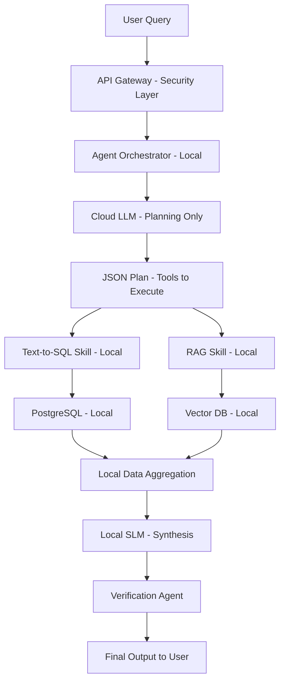

# Sovereign Infrastructure Blueprint: Secure Agentic AI Architecture

## Executive Summary

A comprehensive blueprint for deploying a sovereign agentic AI platform that synthesizes national research data with absolute security and verifiability.

**Core Asset**: 600GB confidential database of Indian researchers, projects, and scientific developments
**Budget**: ~40 crore INR allocated by Gujarat government tech departments
**Mandate**: Build interface to unlock latent value securely

## The Problem with Current Approaches

### Legacy Methods (Inadequate):
1. **Manual SQL Queries**
   - Unscalable
   - Requires expert users
   - Cannot uncover semantic connections

2. **Basic Chatbots**
   - High hallucination risk
   - Context fragmentation
   - Catastrophic data leakage potential

**Required Solution**: State-of-the-art Agentic AI platform with strict data segregation

## Architectural Paradigm: Cognitive Delegation

### Traditional RAG (Risky):
```
User Query → Retrieve Raw Data → Inject into LLM Prompt → Generate Response
```
**Problem**: Raw data exposed to cloud LLM = privacy vulnerability

### Cognitive Delegation (Secure):
```
User Query → LLM Plans → Local Execution → LLM Synthesizes Retrieved Facts Only
```
**Advantage**: Data never leaves local environment

## High-Level System Architecture

### Components:
1. **Cloud-Based LLM** (Gemini/Claude) - Orchestration & Planning Only
2. **Local Sandbox** - Data Execution Layer
3. **Secure Boundary** - Zero data transmission

### Data Flow Orchestration



## Detailed Component Flow

### 1. Query Intake & Security
**User Query**: "Synthesize trends in autonomous robotics research + aggregate PI funding (last 3 fiscal years)"

**API Gateway (Kong AI Gateway)**:
- Input sanitization
- Prompt injection detection
- Adversarial jailbreak interception
- Rate limiting
- DLP (Data Loss Prevention)

### 2. Orchestration & Planning
**Agent Orchestrator** (LangGraph):
- Receives sanitized prompt
- Packages intent + available skills registry
- Sends to cloud LLM (metadata only, no data)

**Cloud LLM Response**: 
- Analyzes semantic structure
- Determines multi-hop approach needed
- Returns JSON plan with tool sequence

Example Plan:
```json
{
  "steps": [
    {"tool": "text-to-sql", "params": {"tables": ["funding", "researchers"]}},
    {"tool": "vector_search", "params": {"query": "autonomous robotics trends", "filter": "2022-2025"}}
  ]
}
```

### 3. Tool Execution - Two Parallel Paths

#### Path A: Structured Data (Text-to-SQL)
1. **Schema Provision**: Pruned, role-based schema only
   - Table names
   - Column headers
   - Data types (no actual data)

2. **SQL Generation**: Cloud LLM generates precise SQL query string

3. **Local Execution**: 
   - Orchestrator executes SQL locally
   - Read-only, sandboxed connection
   - Results stored in volatile memory only
   - Zero network transmission of results

#### Path B: Unstructured Data (RAG)
1. **Embedding Generation**: Local model converts query to vector
   - Model: HuggingFace TEI or similar
   - Entirely offline operation

2. **Vector Search**: Query local Qdrant database
   - **Optimization**: Use SQL results (researcher names, IDs) to pre-filter search space
   - Improves recall & speed substantially

3. **Chunk Retrieval**: Most semantically relevant document chunks
   - Loaded into local memory
   - Never transmitted

### 4. Local Synthesis & Verification

**Local SLM** (Llama 3 8B, quantized):
- **Purpose**: Final synthesis of facts into structured report
- **Why local**: Cannot send aggregated data to cloud (leakage risk)
- **Process**: 
  - Combines tabular data + text chunks
  - Formats into requested structure
  - Drafts initial report

**Verification Agent** (Local Loop):
- Cross-references draft against retrieved source chunks
- Identifies hallucinated claims
- Highlights unsupported logical leaps
- Ensures 100% factual consistency

**Final Delivery**: Verified, structured report to user

## Recommended Technology Stack

### Core Infrastructure

| Component | Technology | Strategic Justification |
|-----------|------------|-------------------------|
| **Agent Orchestration** | LangGraph | Deterministic graph-based control flows, state persistence, error recovery |
| **Vector Database** | Qdrant | Rust-based, sub-20ms latency at scale, native metadata filtering |
| **Relational DB** | PostgreSQL | ACID compliance, advanced indexing, reliability |
| **Secure API Gateway** | Kong AI Gateway | Content-aware LLM prompt inspection, DLP, audit trails |
| **Embedding Model** | HuggingFace TEI | Efficient local vectorization, privacy-critical |
| **Local SLM** | Llama 3 (8B quantized) | On-premise synthesis, no external compute |
| **Cloud Reasoning** | Gemini 1.5 Pro / Claude 3.5 | Complex JSON tool calling, instruction following |

### Why LangGraph for Orchestration?

**Comparison with alternatives:**
- **AutoGen**: Strong in multi-agent conversation, less deterministic
- **CrewAI**: Good for role-based delegation, insufficient for database workflows
- **LangGraph**: 
  - DAG + cyclic capabilities
  - Explicit error-handling pathways
  - Human-in-the-loop checkpoints
  - State rollback capabilities
  - LangSmith integration for auditability

### Why Qdrant for Vector Search?

**Comparison with alternatives:**
- **pgvector**: Convenient but degrades >50M vectors
- **Milvus**: Scalable to billions but high operational complexity
- **Qdrant**:
  - Rust-based (memory safety)
  - Sub-20ms latency at 50M+ vectors
  - HNSW indexing optimization
  - **One-stage metadata filtering** (critical for hybrid search)

## Security & Digital Sovereignty Plan

### The Principle: Cognitive Abstraction

**To Stakeholders**: "The 600GB repository resides exclusively on bare-metal Indian servers. The system is architecturally incapable of uploading files or rows to the internet."

**How it works**:

1. **Local Data Residency**
   - Servers physically in India
   - No internet upload capability
   - Network-level blocking

2. **Blind Cloud Consultation**
   - LLM receives structural puzzle (query + metadata map)
   - Generates database command only
   - Returns command, not data

3. **Local Execution**
   - Extraction, reading, comprehension happens locally
   - Locally hosted algorithms process data
   - Separation of brain (cloud) and hands (local)

### Dynamic Tokenization & FPE

**For sensitive entities in prompts:**

1. **Tokenization**: Gateway intercepts, replaces with synthetic tokens
   - Example: `Aadhaar: 1234-5678-9012` → `id_token_7f9c3a`

2. **LLM Processing**: Reasons over tokenized prompt

3. **Detokenization**: Gateway restores original values before local execution

**Result**: Metadata traversing network is useless to interceptors

### Regulatory Compliance

**Digital Personal Data Protection (DPDP) Act 2023**: 
- Strict data governance
- Data minimization
- Purpose limitation
- Role-based access control

**Implementation**:

1. **RBAC in Vector DB**: Permission scope injected into every search query
   - Prevents unauthorized retrieval
   - Automatic filtering at database level

2. **Immutable Audit Logging**
   - Every agentic decision logged
   - Cryptographic hashes on permissioned ledger (optional Hyperledger)
   - Total regulatory transparency

## Strategic Proposal: The "Name and Fame" Pitch

### The Paradigm Shift: Old Way vs. Our Way

| Capability | Old Way (Manual/Basic Chatbot) | Our Way (Sovereign Agentic) |
|------------|--------------------------------|-----------------------------|
| **Data Security** | High leakage risk, weak controls | 100% Zero-Leakage, on-premise |
| **Query Processing** | Keyword matching, rigid SQL | Deep semantic, dynamic SQL + hybrid search |
| **Analytical Depth** | Single-turn, high hallucination | Multi-hop reasoning, local verification |
| **Scalability** | Human bottleneck, rigid structure | Infinitely scalable agentic workflows |

### The Autonomous Research Protocol

**User Query**: "Evolution of sustainable energy technologies in region"

**Our System Does**:
1. Queries database for funding statistics
2. Searches vector DB for semantic summaries
3. Cross-references findings
4. Identifies research overlap
5. Drafts verified briefing document
6. All in seconds, fully insulated

**Old System Gives**: List of hyperlinks

### Cultivating Institutional Prestige

**Framing**: "Indigenous technological triumph from IIT Gandhinagar"

**Advantages for Government**:
- Trusted, verifiable, academically rigorous partner
- Mitigates vendor lock-in risks
- Sovereign capability development

**National Mission Alignment**:
- **IndiaAI Mission**: Democratization, sovereign computing, population-scale solutions
- **ANRF Mission**: "Open, interoperable AI ecosystem"
- **AI-SE Mandate**: Building models from Indian data

**Thought Leadership**:
- IIT Gandhinagar becomes premier national center for:
  - AI governance
  - Secure data architecture
  - Autonomous systems engineering
- Builds on ARC Centre success
- Transitions theory to production-grade infrastructure

## Implementation Roadmap: 8-Month Plan

### Phase 1: Architecture Blueprint & PoC (Months 1-2)

**Objective**: Validate cognitive delegation model with synthetic data

**Deliverables**:
1. **LangGraph Environment**
   - Define agentic nodes (receiver, router, executors, synthesizer)
   - Setup state management

2. **Local Database Stack**
   - PostgreSQL instance (Docker)
   - Qdrant vector container (Docker)

3. **Synthetic Dataset**
   - 1GB mock data (researcher profiles, funding, abstracts)

4. **Text-to-SQL Skill**
   - Dynamic schema extraction (SQLAlchemy)
   - Read-only sandbox execution
   - Schema-only metadata to LLM

5. **RAG Skill**
   - Local embedding model
   - Qdrant vector storage
   - Mock abstracts for testing

6. **End-to-End Demonstration**
   - Complex query → routing → extraction → synthesis
   - Prove zero-leakage architecture

**Phase 1 Success Criteria**:
- Agent successfully interprets complex queries
- Routes correctly to local databases
- Retrieves and synthesizes mock data
- Zero cloud data transmission

### Phase 2: 600GB Data Ingestion & Scaling (Months 3-5)

**Objective**: Scale infrastructure to production dataset

**Requirements**:
- Multi-core CPUs (high-performance)
- 128-256GB RAM minimum
- NVMe SSDs for rapid I/O

**Tasks**:
1. **Migration**
   - 600GB to secure PostgreSQL cluster
   - Advanced indexing on high-query columns

2. **Unstructured Pipeline**
   - Semantic chunking (512-token overlapping chunks)
   - Batch embedding processing
   - Qdrant cluster deployment

3. **Metadata Tagging**
   - Access-control labels
   - Publication dates
   - Institutional affiliations
   - Thematic categories
   - **Critical**: Enables one-stage filtering

4. **Advanced Workflows**
   - Autonomous self-reflection
   - Retry loops with heuristic fallbacks
   - Error recovery mechanisms

5. **Performance Optimization**
   - Query profiling
   - Caching strategies
   - Load testing

**Phase 2 Success Criteria**:
- Sub-second latency maintained at scale
- All 600GB indexed and searchable
- Reliable agentic workflows with self-recovery

### Phase 3: Security Hardening & Deployment (Months 6-8)

**Objective**: Production-ready enterprise application

**Tasks**:

1. **Security Formalization**
   - Kong AI Gateway deployment
   - Rate limiting policies
   - Comprehensive audit logging
   - DLP rules configuration

2. **RBAC Implementation**
   - Application-level permissions
   - Database-level filtering
   - Dynamic connection clearance
   - Prevents horizontal traversal

3. **Frontend Development**
   - Streamlit or React UI
   - Conversational interface
   - Dynamic visualizations
   - Citation linking
   - Complexity abstraction

4. **Testing & Validation**
   - Red-teaming (prompt injection)
   - Performance benchmarking (high concurrency)
   - Adversarial testing
   - User acceptance testing

5. **Production Deployment**
   - Sovereign bare-metal infrastructure
   - Monitoring & observability
   - Incident response procedures

**Phase 3 Success Criteria**:
- Zero vulnerabilities in security audit
- Handles 1000+ concurrent users
- Intuitive UI for all three personas
- Government-ready deployment

## Final Deliverables

### Technical:
- Sovereign agentic AI platform
- 600GB searchable database
- Zero-data-leakage architecture
- Complete audit system
- Role-based access control

### Documentation:
- Technical architecture report
- Security audit documentation
- User manuals (3 personas)
- Deployment guide
- Maintenance procedures

### Strategic:
- Pitch deck for national infrastructure
- Proposal for scale to other IITs/NITs
- Thought leadership positioning
- Reference architecture documentation

## Success Metrics

### Technical Metrics:
- Latency: <1 second for 95% of queries
- Accuracy: >98% factual consistency
- Uptime: 99.9% availability
- Security: Zero leakage incidents

### User Metrics:
- Query success rate: >90% natural language understanding
- User satisfaction: >85% across personas
- Adoption: 500+ active users in first quarter

### Strategic Metrics:
- Government funding secured: 40+ crore
- Scale to 5+ institutions within 18 months
- Academic publications: 3+ papers on sovereign AI
- Media coverage: National recognition

## Risk Mitigation

| Risk | Probability | Mitigation |
|------|-------------|------------|
| Data leakage | Low | Multi-layer security, zero-trust, audit trails |
| Performance degradation | Medium | Optimization, caching, horizontal scaling |
| Stakeholder buy-in | Medium | Regular demos, clear ROI, political positioning |
| Technical complexity | Medium | Phased approach, expert consultation, testing |
| Resource constraints | Low | Clear roadmap, student team, faculty guidance |

## Conclusion: The Opportunity

This is a **defining moment** for IIT Gandhinagar and Indian sovereign AI infrastructure. Success means:

1. **Technology**: World-class sovereign AI platform
2. **Prestige**: IIT Gandhinagar as national AI leader
3. **Impact**: Transform India's research ecosystem
4. **Legacy**: Blueprint for national infrastructure
5. **Sovereignty**: Indian data, Indian AI, Indian future

**The goal**: Cement institute's position as premier architect of secure, agentic AI infrastructure for the nation.
