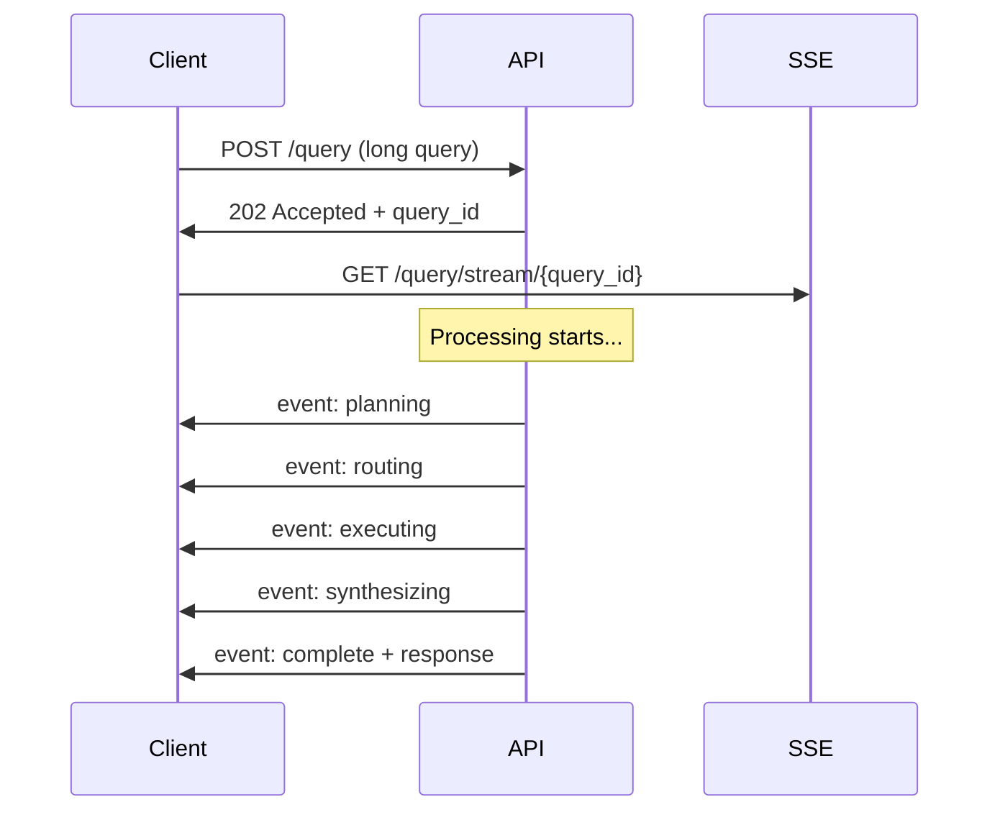

# ADR-008: Streaming SSE Approach

**Date:** 2026-04-21  
**Status:** Accepted  
**Deciders:** Architecture Team, Frontend Team  
**Review:** 2026-10-21

---

## Context

NRG's query responses involve LLM synthesis which can take 3-30 seconds. Users expect:
- Real-time feedback during processing
- Progressive results display
- No timeout for long queries

We evaluated polling, WebSockets, and Server-Sent Events (SSE).

---

## Decision

Use **Server-Sent Events (SSE)** for streaming responses with the following pattern:

1. Immediate acknowledgment with query ID
2. Progressive status updates via SSE
3. Final response with full metadata

---

## Alternatives Considered

| Option | Pros | Cons | Verdict |
|--------|------|------|---------|
| **SSE** (chosen) | Simple, HTTP-compatible, automatic reconnect | One-directional | ✅ Accepted |
| WebSockets | Bidirectional, lower latency | Complexity, proxy issues | ❌ Rejected |
| Polling | Simple implementation | Latency, server load | ❌ Rejected |
| gRPC streaming | High performance | Complexity, browser support | ❌ Rejected |

---

## Rationale

### 1. HTTP Compatible
SSE works over standard HTTP/HTTPS, simplifying:
- Load balancer configuration
- Firewall traversal
- CDN caching

### 2. Automatic Reconnection
Browsers automatically reconnect on connection loss:
```javascript
const eventSource = new EventSource(`/query/stream/${queryId}`);
eventSource.onmessage = (event) => {
  const data = JSON.parse(event.data);
  updateProgress(data);
};
```

### 3. Simplicity
SSE requires less infrastructure than WebSockets:
```python
@app.get("/query/stream/{query_id}")
async def stream_query(query_id: str):
    async def event_generator():
        for status in get_query_status_stream(query_id):
            yield f"data: {json.dumps(status)}\n\n"
    return StreamingResponse(event_generator(), media_type="text/event-stream")
```

### 4. Backend for Frontend Pattern



---

## Implementation

### API Response Structure

```python
# Initial response (202 Accepted)
{
    "query_id": "uuid-123",
    "status": "processing",
    "stream_url": "/query/stream/uuid-123"
}

# SSE events
event: status
data: {"stage": "planning", "progress": 0.1}

event: status
data: {"stage": "routing", "progress": 0.2, "route": "text_to_sql"}

event: status
data: {"stage": "executing", "progress": 0.4, "results_count": 142}

event: status
data: {"stage": "synthesizing", "progress": 0.7}

event: complete
data: {
    "response": "There are 142 AI researchers...",
    "citations": [...],
    "provenance": {...}
}

event: error
data: {"error": "Rate limit exceeded"}
```

### Frontend Implementation

```typescript
async function queryWithProgress(query: string) {
  const { query_id } = await api.post('/query', { query });

  const eventSource = new EventSource(`/query/stream/${query_id}`);
  let finalResponse = null;

  eventSource.addEventListener('complete', (e) => {
    finalResponse = JSON.parse(e.data);
    eventSource.close();
    displayResponse(finalResponse);
  });

  eventSource.addEventListener('status', (e) => {
    const status = JSON.parse(e.data);
    updateProgressBar(status.progress, status.stage);
  });

  eventSource.addEventListener('error', (e) => {
    displayError('Query failed');
    eventSource.close();
  });

  return finalResponse;
}
```

### Backend Streaming

```python
from fastapi import APIRouter
from sse_starlette.sse import EventStreamResponse

router = APIRouter()

@router.get("/query/stream/{query_id}")
async def stream_query_status(query_id: str):
    async def event_generator():
        async for status in query_manager.get_status_stream(query_id):
            yield {
                "event": status["stage"],
                "data": json.dumps(status)
            }
        yield {"event": "done", "data": "{}"}

    return EventStreamResponse(event_generator())

@router.post("/query")
async def create_query(request: QueryRequest):
    query_id = await query_manager.create(
        query=request.query,
        user_id=get_current_user()["id"]
    )
    # Start processing in background
    asyncio.create_task(process_query_async(query_id))

    return {"query_id": query_id, "status": "processing"}
```

---

## Performance Considerations

| Aspect | Target | Notes |
|--------|--------|-------|
| Time to first event | < 100ms | Fast acknowledgment |
| Event frequency | 1-5 per second | Smooth progress updates |
| Total stream duration | < 60s | Timeout protection |
| Reconnection time | < 1s | Browser handles automatically |

---

## Consequences

### Positive
- Real-time user experience
- Clear progress indication
- Simple implementation
- HTTP compatible (easy proxy/firewall)
- Automatic browser reconnection

### Negative
- One-directional (no client->server during stream)
- Requires persistent connection
- May need connection limits for scaling

### Risks
- SSE connection limit in browsers (6 per domain)
  - Mitigation: Multiplex or use HTTP/2
- Proxy timeout for long streams
  - Mitigation: Periodic keepalive comments

---

## Fallback Behavior

```python
# If SSE not supported or fails
@app.post("/query")
async def query_no_stream(request: QueryRequest):
    # Synchronous response with timeout
    try:
        result = await asyncio.wait_for(
            process_query(request.query),
            timeout=30
        )
        return result
    except asyncio.TimeoutError:
        return {
            "query_id": generate_id(),
            "status": "queued",
            "poll_url": f"/query/status/{query_id}"
        }
```

---

**Reviewed by:** Frontend Team, Architecture Team  
**Sign-off:** 2026-04-21