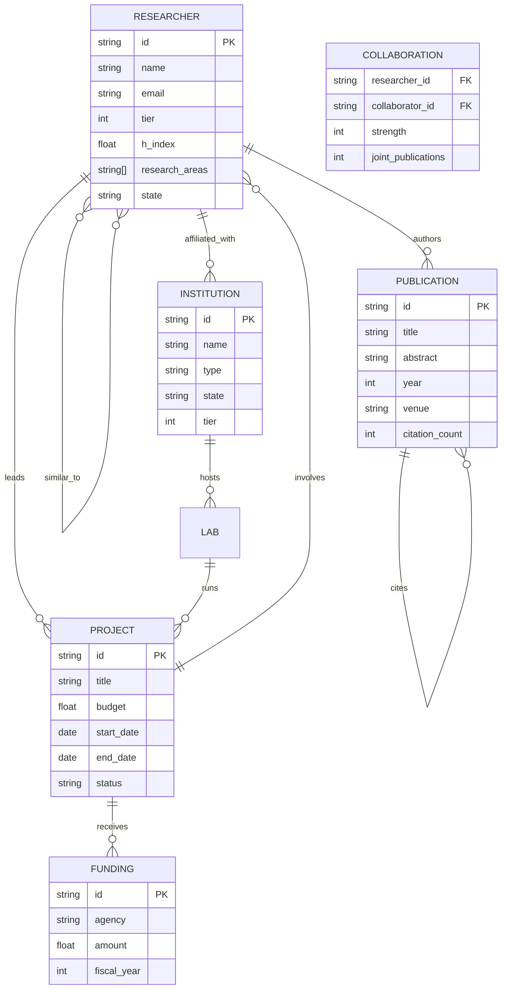
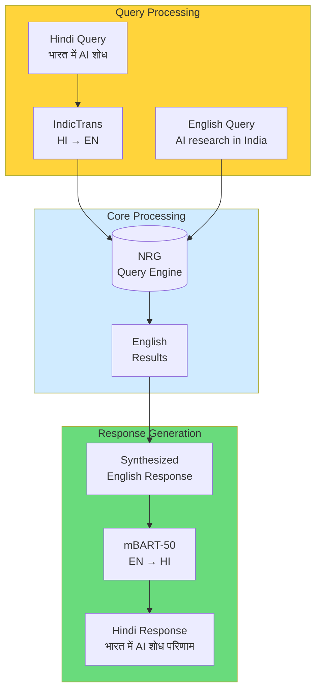

# NRG Phase 2 Product Requirements Document

**Version:** 2.0
**Date:** 2026-04-21
**Status:** Approved
**Budget:** ₹33 Lakhs
**Timeline:** Q3-Q4 2026

---

## Executive Summary

Phase 2 of the National Research Graph builds on the Phase 1 foundation with three major capability additions:

1. **Fine-tuning Pipeline**: Domain-adapted embeddings for Indian research
2. **Knowledge Graph Expansion**: Neo4j integration for relationship traversal
3. **Multi-language Support**: Hindi and regional language query/response

This phase enables sovereign AI capabilities tailored to Indian research context while maintaining DPDP-2023 compliance.

---

## 1. Fine-Tuning Pipeline

### 1.1 Objectives

Create domain-specific embeddings optimized for:
- Indian research paper terminology
- Regional language transliteration
- Institution and scheme naming conventions

### 1.2 Architecture

```mermaid
graph TB
    subgraph Training["Training Pipeline"]
        DATA[(50K Labeled<br/>Research Abstracts)]
        PREP[Data Preprocessing<br/>Chunking + Labeling]
        BASE[Base Model<br/>BGE-M3]
        LORA[LoRA Adapter<br/>Training]
        EVAL[Evaluation<br/>Recall@10, NDCG]
        REGISTRY[(Model Registry<br/>MLflow)]
    end

    subgraph Inference["Inference Pipeline"]
        QUERY[User Query]
        EMBED[Fine-tuned Embedder]
        QDRANT[(Qdrant<br/>Vector Search)]
        RETRIEVE[Retrieval Results]
    end

    DATA --> PREP
    PREP --> LORA
    BASE --> LORA
    LORA --> EVAL
    EVAL --> REGISTRY
    REGISTRY --> EMBED
    QUERY --> EMBED
    EMBED --> QDRANT
    QDRANT --> RETRIEVE

    style Training fill:#d0ebff
    style Inference fill:#e7f5ff
```

### 1.3 Technical Specifications

| Component | Specification |
|-----------|---------------|
| Base Model | BAAI/bge-m3 (768-dim embeddings) |
| Training Data | 50,000 labeled research abstracts |
| Fine-tuning Method | LoRA (rank=16, alpha=32) |
| Training Framework | Axolotl + QLoRA |
| GPU Requirement | 1x NVIDIA A100 (40GB) |
| Training Time | ~8 hours per epoch |
| Epochs | 3-5 with early stopping |
| Evaluation Metrics | Recall@10, MRR@10, NDCG@10 |

### 1.4 Training Data Preparation

```python
# Data preparation pipeline
class ResearchDataProcessor:
    def __init__(self, corpus_path: str):
        self.corpus_path = corpus_path

    def prepare_training_data(self) -> Dataset:
        """
        Prepare 50K labeled examples:
        - Query-document pairs from search logs
        - Hard negatives from similar topics
        - Cross-lingual pairs (EN-HI)
        """
        pairs = []

        # Positive pairs: query and relevant document
        for log in search_logs:
            doc = get_document(log["doc_id"])
            pairs.append({
                "query": log["query"],
                "document": doc["abstract"],
                "label": 1.0,
                "language": detect(log["query"])
            })

        # Hard negatives: similar but not relevant
        for doc in corpus:
            hard_neg = find_hard_negative(doc, k=4)
            pairs.append({
                "query": doc["title"],
                "document": hard_neg["abstract"],
                "label": 0.0
            })

        return Dataset.from_list(pairs)

    def augment_with_translation(self, dataset: Dataset) -> Dataset:
        """Augment with Hindi translations for cross-lingual training."""
        hi_samples = []
        for sample in dataset:
            hi_translation = indic_trans.translate(
                sample["query"],
                source="eng_Latn",
                target="hin_Deva"
            )
            hi_samples.append({
                **sample,
                "query": hi_translation,
                "language": "hi"
            })
        return Dataset.concat([dataset, Dataset.from_list(hi_samples)])
```

### 1.5 Training Configuration

```yaml
# finetune_config.yaml
base_model: BAAI/bge-m3
output_dir: ./models/bge-m3-finetuned

quantization:
  load_in_4bit: true
  bnb_4bit_compute_dtype: float16

lora:
  r: 16
  lora_alpha: 32
  target_modules: ["query", "value", "dense"]
  lora_dropout: 0.05

training:
  per_device_batch_size: 8
  gradient_accumulation_steps: 4
  num_epochs: 5
  learning_rate: 2e-4
  warmup_ratio: 0.1
  logging_steps: 50
  eval_steps: 500
  save_steps: 1000
  early_stopping_patience: 3

data:
  train_split: 0.9
  validation_split: 0.1
  max_seq_length: 512
  add_instruction_prefix: true

evaluation:
  metrics: ["recall@10", "mrr@10", "ndcg@10", "map"]
  eval_dataset_size: 1000
```

### 1.6 Evaluation Harness

```python
class EmbeddingEvaluator:
    """Benchmark fine-tuned vs base model."""

    def evaluate(self, model: str, test_set: TestSet) -> EvaluationResult:
        results = []

        for query, relevant_docs in test_set:
            retrieved = self.retrieve(query, model, top_k=10)
            metrics = self.compute_metrics(retrieved, relevant_docs)
            results.append(metrics)

        return {
            "recall@10": np.mean([r["recall"] for r in results]),
            "mrr@10": np.mean([r["mrr"] for r in results]),
            "ndcg@10": np.mean([r["ndcg"] for r in results]),
            "improvement_over_base": self.compute_improvement(results)
        }

    def compute_improvement(self, results: list) -> float:
        base_recall = self.get_base_model_recall()
        fine_tuned_recall = np.mean([r["recall"] for r in results])
        return ((fine_tuned_recall - base_recall) / base_recall) * 100
```

---

## 2. Neo4j Knowledge Graph Integration

### 2.1 Objectives

Extend the current DB-backed graph endpoint to a full knowledge graph with:
- Rich relationship types
- Graph traversal queries
- Collaborative filtering
- "Similar researchers/papers" recommendations

### 2.2 Data Model



### 2.3 Cypher Query Examples

```cypher
-- Find AI researchers in Gujarat with high h-index
MATCH (r:Researcher)-[:AFFILIATED_WITH]->(i:Institution)
WHERE r.research_areas CONTAINS 'AI'
  AND i.state = 'Gujarat'
  AND r.h_index > 20
RETURN r.name, r.h_index, i.name
ORDER BY r.h_index DESC
LIMIT 20

-- Find potential collaborators for a researcher
MATCH (r:Researcher {name: 'Dr. R. Patel'})-[:AFFILIATED_WITH]->(i:Institution)
MATCH (r)-[:COLLABORATES_WITH]->(c:Researcher)
WHERE NOT (r)-[:COLLABORATES_WITH]->(c)
  AND c.research_areas = r.research_areas
  AND c.tier = 1
RETURN c.name, c.h_index, COUNT {
    MATCH (c)-[:AUTHORS]->(p:Publication)<-[:AUTHORS]-(r)
} AS mutual_publications
ORDER BY mutual_publications DESC
LIMIT 10

-- Funding trends by agency and year
MATCH (p:Project)-[:FUNDED_BY]->(f:Funding)
WHERE p.status = 'Completed'
RETURN f.agency, f.fiscal_year, SUM(f.amount) AS total_funding
ORDER BY f.fiscal_year DESC, total_funding DESC

-- Research area evolution
MATCH (r:Researcher)-[:AUTHORS]->(pub:Publication)
WHERE pub.year >= 2020
RETURN r.research_areas[0] AS area, COUNT(DISTINCT r) AS researcher_count,
       COUNT(pub) AS publication_count, AVG(pub.citation_count) AS avg_citations
ORDER BY publication_count DESC
LIMIT 10
```

### 2.4 Neo4j Configuration

```yaml
# neo4j_config.yaml
neo4j:
  uri: bolt://neo4j:7687
  username: nrg_admin
  password: ${NEO4J_PASSWORD}
  database: nrg_knowledge_graph

  # Connection pool
  max_connection_lifetime: 3600
  max_connection_pool_size: 50
  connection_acquisition_timeout: 60

  # Query timeouts
  default_query_timeout: 30

  # Indexes
  indexes:
    - :Researcher(id)
    - :Researcher(h_index)
    - :Researcher(research_areas)
    - :Publication(year)
    - :Institution(state)

  # Constraints
  constraints:
    - CONSTRAINT researcher_id UNIQUE FOR (r:Researcher)
    - CONSTRAINT publication_id UNIQUE FOR (p:Publication)
```

### 2.5 Graph API Endpoints

| Endpoint | Method | Description |
|----------|--------|-------------|
| `/query/graph` | POST | Natural language graph query |
| `/graph/researchers/{id}` | GET | Researcher profile with relationships |
| `/graph/path` | POST | Find shortest path between researchers |
| `/graph/recommendations` | GET | Get similar researchers/papers |

```python
# Graph query endpoint
@app.post("/query/graph")
async def query_knowledge_graph(
    request: GraphQueryRequest,
    token: dict = Depends(get_current_user)
):
    """
    Natural language graph query.
    Example: "Who are potential collaborators for Dr. R. Patel?"
    """
    # Convert NL to Cypher
    cypher = nl_to_cypher_converter.convert(request.query)

    # Execute with tier-based filtering
    results = await execute_cypher(
        cypher,
        user_tier=token["tier"],
        params=request.params
    )

    # Format response
    return {
        "nodes": format_nodes(results),
        "edges": format_edges(results),
        "query": request.query,
        "cypher_generated": cypher,
        "execution_time_ms": get_execution_time()
    }
```

---

## 3. Multi-Language Support

### 3.1 Scope

| Language | Query Input | Response Output | Priority |
|----------|------------|-----------------|----------|
| English | ✅ | ✅ | P0 (base) |
| Hindi (हिंदी) | ✅ | ✅ | P0 |
| Gujarati (ગુજરાતી) | ✅ | ✅ | P1 |
| Tamil (தமிழ்) | ✅ | ✅ | P1 |
| Telugu (తెలుగు) | ✅ | ✅ | P1 |

### 3.2 Architecture



### 3.3 Translation Pipeline

```python
class MultiLanguageProcessor:
    """Handle multi-language queries and responses."""

    def __init__(self):
        self.transliterate = IndicTrans()  # English ↔ Indian languages
        self.mbart = mBART_50()  # English → 50 languages

    async def process_query(self, query: str, target_lang: str = "en") -> str:
        """
        Detect language and translate to English for processing.
        """
        detected_lang = langdetect.detect(query)

        if detected_lang != "en":
            # Translate to English
            english_query = self.transliterate.translate(
                query,
                source=self.LANG_CODE_MAP[detected_lang],
                target="eng_Latn"
            )
            logger.info(f"Translated {detected_lang} → EN: {english_query}")
            return english_query

        return query

    async def generate_response(
        self,
        english_response: str,
        target_lang: str
    ) -> str:
        """
        Translate response back to user's language.
        """
        if target_lang == "en":
            return english_response

        # Use mBART-50 for translation
        translated = self.mbart.translate(
            english_response,
            source_lang="eng_Latn",
            target_lang=self.LANG_CODE_MAP[target_lang]
        )

        # Post-process for Devanagari script correction
        if target_lang in ["hi", "mr", "ne"]:
            translated = self.fix_devanagari_utf(translated)

        return translated

    LANG_CODE_MAP = {
        "en": "eng_Latn",
        "hi": "hin_Deva",
        "gu": "guj_Gujr",
        "ta": "tam_Taml",
        "te": "tel_Telu",
        "mr": "mar_Deva",
        "bn": "ben_Beng",
    }
```

### 3.4 Hindi Query Examples

```python
# Example queries and translations

test_cases = [
    {
        "input": "गुजरात में AI शोधकर्ता",
        "expected_translation": "AI researchers in Gujarat",
        "language": "hi"
    },
    {
        "input": "2024 में सबसे ज्यादा प्रभावशाली शोध पत्र",
        "expected_translation": "Most impactful research papers in 2024",
        "language": "hi"
    },
    {
        "input": "कर्नाटक में वित्त पोषण प्रवृत्तियां",
        "expected_translation": "Funding trends in Karnataka",
        "language": "hi"
    }
]
```

### 3.5 Response Quality Guidelines

| Metric | Target | Measurement |
|--------|--------|-------------|
| Translation accuracy (BLEU) | > 0.8 | Automated scoring |
| Semantic similarity | > 0.85 | BERTScore |
| User preference | > 70% | User study |
| Latency overhead | < 2 seconds | End-to-end timing |

---

## 4. Mobile App Considerations

### 4.1 Scope (Phase 2)

For Phase 2, mobile is **research only** — wireframes and API contracts defined, native app Phase 3.

### 4.2 API Contracts for Mobile

```yaml
# Mobile API requirements
paths:
  /mobile/auth/verify:
    post:
      summary: OTP verification for mobile
      description: Verify phone number with OTP
      requestBody:
        content:
          application/json:
            schema:
              type: object
              properties:
                phone:
                  type: string
                otp:
                  type: string
              example:
                phone: "+919876543210"
                otp: "123456"

  /mobile/profile:
    get:
      summary: Get mobile-optimized profile
      description: Lightweight profile for mobile
      responses:
        '200':
          content:
            application/json:
              schema:
                $ref: '#/components/schemas/MobileProfile'

  /mobile/query/voice:
    post:
      summary: Voice query
      description: |
        Upload voice query (up to 60 seconds).
        Returns text transcription + query result.
      requestBody:
        content:
          audio/mp4:
            schema:
              type: string
              format: binary
      responses:
        '200':
          content:
            application/json:
              schema:
                $ref: '#/components/schemas/VoiceQueryResponse'
```

### 4.3 Mobile Profile Schema

```yaml
MobileProfile:
  type: object
  properties:
    id:
      type: string
    name:
      type: string
    organization:
      type: string
    research_areas:
      type: array
      items:
        type: string
    recent_queries:
      type: array
      items:
        $ref: MobileQuerySummary
    saved_searches:
      type: array
      items:
        type: object
        properties:
          id: string
          query: string
          created_at: string

MobileQuerySummary:
  type: object
  properties:
    query:
      type: string
    response_preview:
      type: string
      maxLength: 100
    timestamp:
      type: string
      format: date-time
```

---

## 5. Timeline and Milestones

### 5.1 Phase 2 Gantt Chart

```
2026
     Q3                      Q4
     Jul Aug Sep Oct Nov Dec
     |---|---|
Fine-tuning   |   |
Pipeline      |   |
              |   |
Neo4j         |   |
Integration   |   |
              |   |
Hindi         |   |
Support       |   |
              |   |
Mobile        |   |
Wireframes    |   |
              |   |
Testing &     |
V&V           |
```

### 5.2 Detailed Milestones

| Milestone | Target Date | Description |
|-----------|-------------|-------------|
| M2.1: Data collection | 2026-07-15 | Compile 50K labeled research abstracts |
| M2.2: Training pipeline ready | 2026-08-01 | LoRA training infrastructure |
| M2.3: Model v1 trained | 2026-08-30 | Fine-tuned embeddings ready |
| M2.4: Evaluation complete | 2026-09-15 | Benchmark vs base model |
| M2.5: Neo4j schema designed | 2026-08-15 | Final graph data model |
| M2.6: Neo4j migration | 2026-09-30 | Move from SQLite graph to Neo4j |
| M2.7: Hindi translation pipeline | 2026-08-15 | IndicTrans + mBART integration |
| M2.8: Hindi UI tested | 2026-09-30 | User acceptance testing |
| M2.9: Regional language v1 | 2026-10-31 | Gujarati, Tamil, Telugu support |
| M2.10: Phase 2 complete | 2026-11-30 | Full Phase 2 delivery |

---

## 6. Budget Allocation

### 6.1 Phase 2 Budget Breakdown

| Category | Item | Cost (₹) |
|----------|------|----------|
| **Infrastructure** | GPU training (A100 × 1 month) | 4,00,000 |
| | Neo4j Enterprise license | 2,00,000 |
| | Qdrant scaling (3 nodes) | 2,00,000 |
| | Storage expansion (500GB) | 1,00,000 |
| | **Subtotal** | **9,00,000** |
| **AI/ML** | IndicTrans fine-tuning | 2,00,000 |
| | mBART-50 model | 1,00,000 |
| | Training compute (50K samples) | 2,00,000 |
| | Evaluation harness | 50,000 |
| | **Subtotal** | **5,50,000** |
| **Personnel** | ML engineer (3 months) | 6,00,000 |
| | Graph database specialist (2 months) | 4,00,000 |
| | Localization engineer (2 months) | 4,00,000 |
| | **Subtotal** | **14,00,000** |
| **Compliance** | Hindi DPDP review | 50,000 |
| | Multi-language audit | 50,000 |
| | Security assessment | 50,000 |
| | **Subtotal** | **1,50,000** |
| **Contingency** | 10% buffer | 3,00,000 |
| **TOTAL** | | **33,00,000** |

### 6.2 Cost Savings vs Phase 1

| Item | Phase 1 Actual | Phase 2 Plan | Savings |
|------|---------------|--------------|---------|
| Infrastructure | ₹8L | ₹9L | - |
| AI/ML | ₹5L | ₹5.5L | - |
| Personnel | ₹4L | ₹14L | Increased capacity |
| Compliance | ₹2L | ₹1.5L | Reused Phase 1 work |
| **Total** | **₹19L** | **₹33L** | |

---

## 7. Risks and Mitigation

### 7.1 Risk Register

| Risk | Probability | Impact | Mitigation |
|------|-------------|--------|------------|
| Fine-tune overfitting | Medium | High | Early stopping, eval harness, held-out test set |
| Neo4j performance at scale | Low | Medium | Benchmark Q1, index optimization |
| Translation quality issues | Medium | Medium | Human review queue, user feedback loop |
| GPU availability | Medium | High | Pre-book A100 instance |
| Language detection errors | Low | Low | Fallback to English processing |
| Neo4j query injection | Low | High | Parameterized queries, input validation |

### 7.2 Mitigation Plans

```python
# Fine-tuning early stopping
class EarlyStoppingCallback:
    def __init__(self, patience: int = 3, min_delta: float = 0.01):
        self.patience = patience
        self.min_delta = min_delta
        self.best_score = None
        self.counter = 0

    def on_eval(self, metrics: dict):
        score = metrics["recall@10"]
        if self.best_score is None:
            self.best_score = score
        elif score < self.best_score + self.min_delta:
            self.counter += 1
            if self.counter >= self.patience:
                return "stop"  # Trigger early stop
        else:
            self.best_score = score
            self.counter = 0
        return "continue"
```

---

## 8. Success Metrics

### 8.1 Phase 2 KPIs

| Metric | Baseline (Phase 1) | Target | Measurement |
|--------|-------------------|--------|-------------|
| Retrieval Recall@10 | 0.65 | 0.80 | Evaluation harness |
| Hindi query success rate | N/A | > 90% | User testing |
| Graph query latency (p95) | N/A | < 2s | APM monitoring |
| Translation quality (BLEU) | N/A | > 0.8 | Automated scoring |
| Cost per query | ₹0.50 | ₹0.35 | Finance tracking |

### 8.2 User Satisfaction

| Metric | Target |
|--------|--------|
| User satisfaction (Hindi) | > 4.0/5.0 |
| Recommendation acceptance rate | > 25% |
| Graph query usage | > 30% of queries |

---

## 9. Dependencies

### 9.1 External Dependencies

| Dependency | Owner | Required By |
|------------|-------|-------------|
| NVIDIA API quota | NVIDIA | M2.3 |
| A100 GPU access | Cloud provider | M2.3 |
| IndicTrans model weights | AI4Bharat | M2.7 |
| mBART-50 model weights | Facebook | M2.7 |

### 9.2 Internal Dependencies

| Dependency | Blocks | Status |
|------------|--------|--------|
| Phase 1 completion | All Phase 2 | ✅ Complete |
| PostgreSQL migration | Neo4j integration | ✅ Complete |
| Observability pipeline | Fine-tuning monitoring | In progress |

---

## 10. Appendix

### A. Fine-tuning Dataset Schema

```python
@dataclass
class TrainingExample:
    query_id: str
    query: str
    query_lang: str
    document_id: str
    document_title: str
    document_abstract: str
    relevance_score: float  # 0.0 to 1.0
    hard_negative_ids: list[str]
    metadata: dict

# Example JSON
{
    "query_id": "q_001",
    "query": "machine learning researchers in Gujarat",
    "query_lang": "en",
    "document_id": "pub_123",
    "document_title": "Deep Learning for Computer Vision",
    "document_abstract": "This paper presents...",
    "relevance_score": 0.95,
    "hard_negative_ids": ["pub_456", "pub_789"],
    "metadata": {
        "year": 2024,
        "citations": 42,
        "authors": ["R. Patel", "S. Sharma"]
    }
}
```

### B. Neo4j Query Templates

```cypher
// Pre-defined queries for common patterns
QUERY_TEMPLATES = {
    "researcher_by_area": """
        MATCH (r:Researcher)-[:AFFILIATED_WITH]->(i:Institution)
        WHERE r.research_areas CONTAINS $area
        RETURN r.name AS name, r.h_index AS h_index, i.name AS institution
        ORDER BY r.h_index DESC LIMIT $limit
    """,
    "collaborators": """
        MATCH (r:Researcher {id: $researcher_id})-[:COLLABORATES_WITH]->(c:Researcher)
        RETURN c.name AS collaborator, c.h_index AS h_index,
               COUNT(pubs) AS joint_publications
    """,
    "funding_trends": """
        MATCH (p:Project)-[:FUNDED_BY]->(f:Funding)
        WHERE f.fiscal_year >= $start_year AND f.fiscal_year <= $end_year
        RETURN f.agency AS agency, f.fiscal_year AS year, SUM(f.amount) AS total
        ORDER BY year, total DESC
    """
}
```

---

**Document Owner:** Product Team
**Review Cycle:** Bi-weekly
**Next Review:** 2026-05-21
**Approval:** Pending Steering Committee