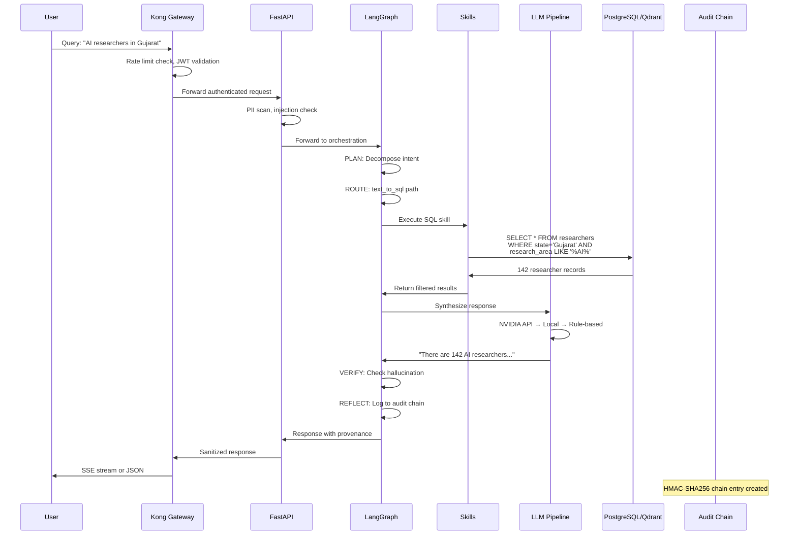
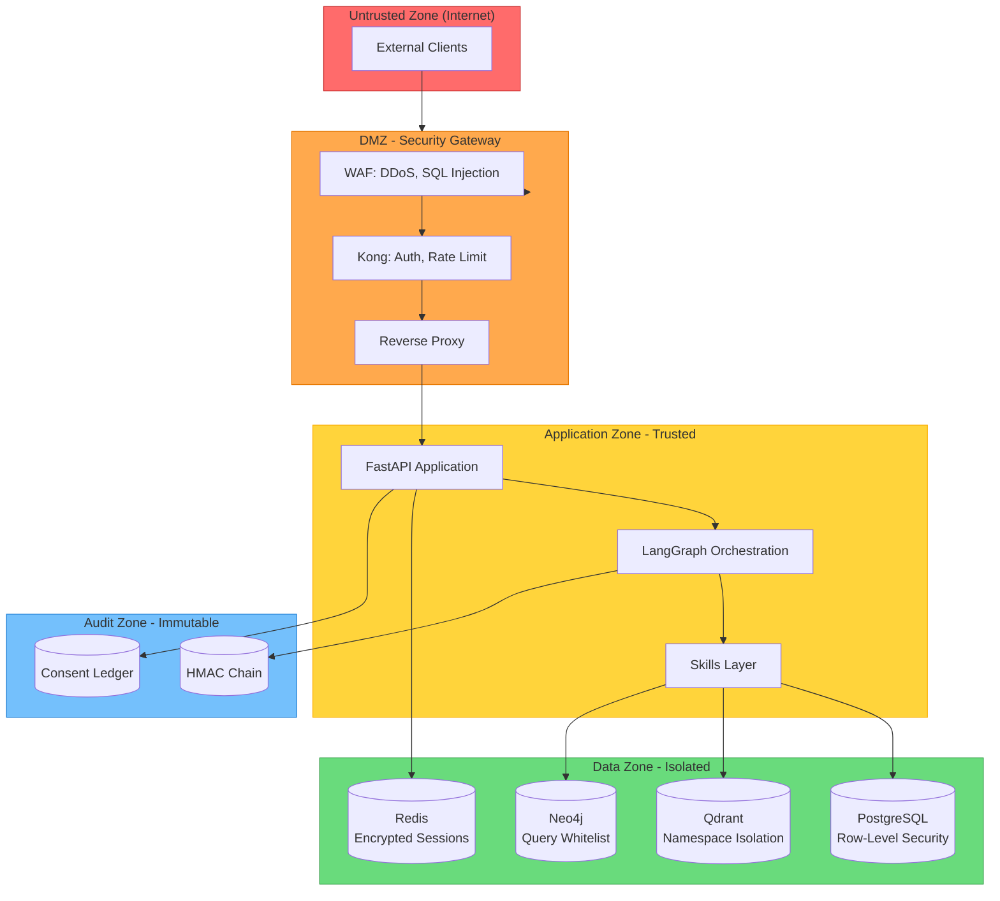
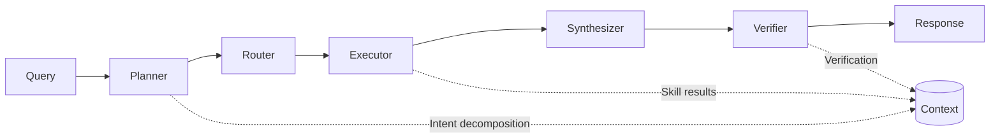
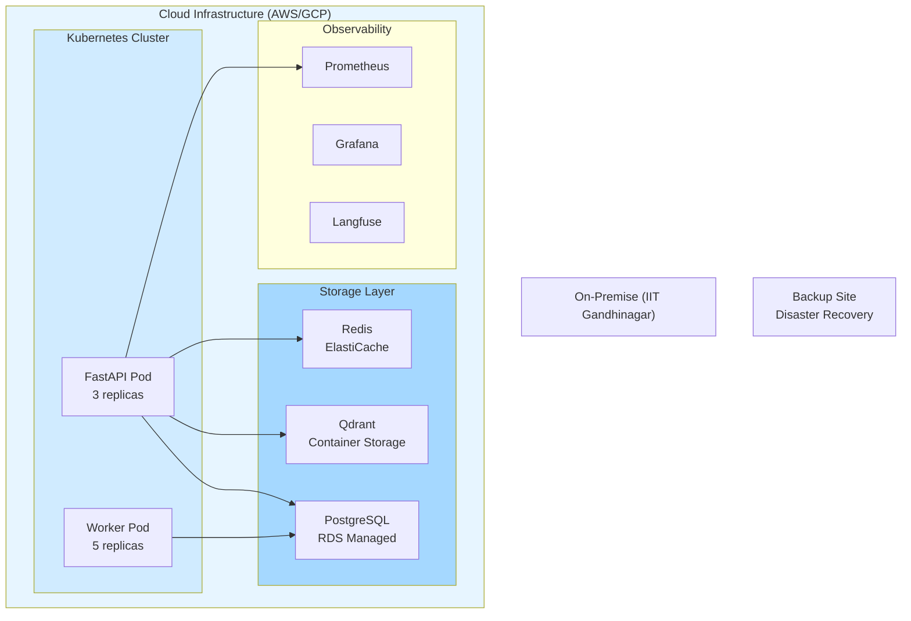

# System Architecture

**Document Version:** 1.0  
**Last Updated:** 2026-04-21  
**Classification:** Government Confidential

---

## 1. High-Level Architecture

```mermaid
graph TB
    subgraph Clients["Client Layer"]
        WEB[Web Dashboard<br/>React + TypeScript]
        MOBILE[Mobile App<br/>React Native]
        API_CLIENT[API Clients<br/>External Systems]
    end

    subgraph Gateway["Security Gateway"]
        KONG[Kong AI Gateway<br/>Rate Limiting + Auth]
        WAF[Web Application Firewall<br/>DPDP Compliance]
    end

    subgraph API["API Layer - FastAPI"]
        AUTH[/auth/login|refresh|logout]
        QUERY[/query<br/>LangGraph Orchestration]
        DATA[/researchers|publications|stats]
        ADMIN[/admin/*<br/>System Management]
        AUDIT[/audit/verify|events]
    end

    subgraph Orchestration["LangGraph Orchestration"]
        PLANNER[Planner Node<br/>Intent Decomposition]
        ROUTER[Router Node<br/>Path Selection]
        EXECUTOR[Executor Node<br/>Skill Execution]
        SYNTH[Synthesizer Node<br/>Response Generation]
        VERIFY[Verifier Node<br/>Truth Verification]
        REFLECT[Reflector Node<br/>Audit Logging]
    end

    subgraph Skills["Skills Layer"]
        SQL_SKILL[Text-to-SQL Skill<br/>Schema-only prompts]
        RAG_SKILL[RAG Skill<br/>Qdrant Vector Search]
        KG_SKILL[Knowledge Graph Skill<br/>Neo4j Traversal]
    end

    subgraph LLM["LLM Pipeline"]
        NVIDIA[NVIDIA API<br/>Llama 3.1 70B]
        LOCAL_LLM[Local Llama.cpp<br/>Sovereign Fallback]
        RULE_BASED[Rule-Based<br/>Offline Mode]
    end

    subgraph Data["Data Layer"]
        SQLite[(SQLite<br/>Development)]
        Postgres[(PostgreSQL<br/>Production)]
        Qdrant[(Qdrant VectorDB<br/>Embeddings)]
        Redis[(Redis Cache<br/>Session + Rate Limit)]
        Neo4j[(Neo4j<br/>Knowledge Graph)]
    end

    subgraph Audit["Audit Layer"]
        HMAC[(HMAC-SHA256<br/>Audit Chain)]
        CONSENT[(Consent Ledger<br/>DPDP-2023)]
    end

    WEB --> KONG
    MOBILE --> KONG
    API_CLIENT --> KONG
    KONG --> WAF
    WAF --> AUTH
    AUTH --> QUERY
    QUERY --> PLANNER
    PLANNER --> ROUTER
    ROUTER --> EXECUTOR
    EXECUTOR --> SQL_SKILL
    EXECUTOR --> RAG_SKILL
    EXECUTOR --> KG_SKILL
    SQL_SKILL --> Postgres
    RAG_SKILL --> Qdrant
    KG_SKILL --> Neo4j
    SYNTH --> NVIDIA
    SYNTH --> LOCAL_LLM
    SYNTH --> RULE_BASED
    VERIFY --> REFLECT
    REFLECT --> HMAC
    REFLECT --> Redis
    PLANNER --> Redis
    NVIDIA --> Postgres
    Postgres --> Redis

    style KONG fill:#ff6b6b
    style WAF fill:#ffa94d
    style HMAC fill:#69db7c
    style Postgres fill:#74c0fc
    style Qdrant fill:#da77f2
```

---

## 2. Data Flow



---

## 3. Security Boundaries and Trust Zones



### Trust Zone Definitions

| Zone | Trust Level | Components | Access Control |
|------|-------------|------------|----------------|
| Internet | Untrusted | External clients | TLS 1.3, mTLS optional |
| DMZ | Low | Kong, WAF | JWT validation, rate limiting |
| Application | Medium | FastAPI, LangGraph | RBAC, PII scanning |
| Data | High | PostgreSQL, Qdrant, Neo4j | Row-level security, namespace |
| Audit | Immutable | HMAC chain | No delete permissions |

---

## 4. Component Responsibilities

### 4.1 Client Layer

| Component | Responsibility | Technology |
|-----------|---------------|------------|
| Web Dashboard | Researcher/Government/Industry UI | React 18 + TypeScript |
| Mobile App | On-the-go access | React Native (Phase 3) |
| API Client | External system integration | REST + SSE |

### 4.2 Security Gateway

| Component | Responsibility | Key Features |
|-----------|---------------|--------------|
| Kong AI Gateway | Auth, Rate Limit, Routing | JWT validation, quota enforcement |
| WAF | DDoS protection, SQL injection prevention | ModSecurity rules |
| Prompt Sanitizer | PII detection, injection blocking | Microsoft Presidio |

### 4.3 API Layer

| Endpoint | Responsibility | Auth |
|----------|---------------|------|
| `/auth/*` | Login, refresh, logout | Public |
| `/query` | Main query orchestration | JWT required |
| `/researchers` | Researcher data access | JWT + tier filter |
| `/publications` | Publication data access | JWT + tier filter |
| `/stats` | Aggregate statistics | JWT + tier filter |
| `/admin/*` | System management | Admin role only |
| `/audit/*` | Audit trail access | Admin or self |

### 4.4 Orchestration Layer



| Node | Responsibility | Output |
|------|---------------|--------|
| Planner | Decompose user intent into sub-tasks | Task graph |
| Router | Select workflow path (SQL/RAG/KG) | Route decision |
| Executor | Execute selected skill(s) | Raw results |
| Synthesizer | Generate natural language response | Draft response |
| Verifier | Check hallucination, factuality | Verified response |
| Reflector | Log to audit chain, update metrics | Audit entry |

### 4.5 Skills Layer

| Skill | Responsibility | Data Source |
|-------|---------------|-------------|
| Text-to-SQL | Natural language to SQL | PostgreSQL |
| RAG | Vector similarity search | Qdrant |
| Knowledge Graph | Graph traversal | Neo4j |

### 4.6 LLM Pipeline

| Provider | Model | Use Case | Fallback |
|----------|-------|----------|----------|
| NVIDIA | Llama 3.1 70B | Primary synthesis | Local → Rule |
| Local | Llama.cpp | Sovereign fallback | Rule-based |
| Rule-based | Template engine | Offline mode | N/A |

---

## 5. External Integrations

### 5.1 NVIDIA API

```yaml
Endpoint: https://integrate.api.nvidia.com/v1/chat/completions
Model: nvidia/llama-3.1-70b-instruct
Auth: API Key in Authorization header
Rate Limit: 100 requests/minute (enterprise)
Features:
  - Streaming responses
  - Function calling
  - Context length: 128K tokens
```

### 5.2 Anthropic API (Future)

```yaml
Endpoint: https://api.anthropic.com/v1/messages
Model: claude-sonnet-4-20250514
Use Case: Optional cloud synthesis
Auth: API Key
Features:
  - Extended context window
  - Constitutional AI
```

### 5.3 Qdrant Vector Database

```yaml
Endpoint: http://qdrant:6333
Collection: nrg_research
Vector Size: 1024 (bge-m3 embeddings)
Distance: Cosine
Payload Indexes:
  - researcher_id
  - institution_id
  - research_area
  - state
```

### 5.4 Redis Cache

```yaml
Endpoint: redis://redis:6379
Use Cases:
  - Session storage (JWT blacklist)
  - Rate limit counters
  - Query result cache (TTL: 30s)
  - LLM response cache
```

---

## 6. Database Architecture

### 6.1 PostgreSQL Schema

```mermaid
erDiagram
    RESEARCHER ||--o{ PUBLICATION : authors
    RESEARCHER ||--o{ PROJECT : leads
    INSTITUTION ||--o{ RESEARCHER : employs
    INSTITUTION ||--o{ LAB : hosts
    LAB ||--o{ PROJECT : runs
    PROJECT ||--o{ FUNDING : receives

    RESEARCHER {
        uuid id PK
        string name
        string email
        string phone
        int tier FK
        string h_index
        string state
    }
    TIER {
        int level PK
        string name
        string permissions JSON
    }
```

### 6.2 Row-Level Security

```sql
-- Tier 1 (Researcher): Full access
-- Tier 2 (Government): Aggregate only
-- Tier 3 (Industry): Anonymized only

CREATE POLICY tier_filter ON researchers
    USING (access_tier >= current_setting('nrg.tier')::int);
```

---

## 7. Deployment Architecture



---

## 8. Error Handling & Resilience

| Failure Mode | Detection | Mitigation |
|-------------|-----------|------------|
| NVIDIA API down | Health check + fallback trigger | Local Llama.cpp |
| Local LLM down | Health check | Rule-based synthesis |
| Qdrant unavailable | Health check | SQL-only fallback |
| PostgreSQL down | Connection pool exhausted | Read from cache |
| Redis down | Connection error | Skip cache, proceed |
| Audit chain broken | Periodic verification | Alert + halt writes |

---

## 9. Performance Targets

| Metric | Target | Measurement |
|--------|--------|-------------|
| Query latency (p95) | < 5 seconds | Langfuse tracing |
| Auth latency | < 200ms | Prometheus |
| Qdrant retrieval | < 500ms | Langfuse span |
| LLM synthesis | < 3 seconds | Token tracking |
| Cache hit rate | > 60% | Redis metrics |
| Availability | 99.5% | Uptime monitor |

---

**Document Owner:** Architecture Team  
**Review Cycle:** Monthly  
**Next Review:** 2026-05-21